# spatiality_v2

**Phone video → 3D scene + open-vocabulary semantic labels + top-down capture map.**

### ▶ [Live demo · spatiality-v2.vercel.app](https://spatiality-v2.vercel.app)

No SfM rig, no calibration, no manual labelling. Walk through a room with your phone; get back a point cloud you can orbit, a labelled inventory of every object, and a 2D top-down density map of what was captured.

Built as a submission for the [Humanoid](https://jobs.ashbyhq.com/humanoid) Perception & Spatial AI internship challenge.

> _If you're a reviewer:_ click the live demo above to see the system end-to-end in one click; then read [Architecture](#architecture) and [What's novel](#whats-novel) for the design decisions. For information on the design choices + tradeoffs, read [Design choices](#design-choices).

&nbsp;

## Why this matters for a humanoid robot

A humanoid platform doing real work in a building needs three things from its environment that today's pipelines tend to ship separately:

- **Dense geometry** for footing, contact, and obstacle avoidance.
- **Open-vocabulary semantics** so a high-level planner can be told "go to the kitchen counter" without retraining a fixed-taxonomy detector for every site.

spatiality_v2 produces all three from a single handheld phone capture. The same artefacts (point cloud, labelled tracks, capture map) are the building-block layer a navigation stack consumes, not a research demo of a single component.

&nbsp;

## Try it

- **Hosted demo**: [spatiality-v2.vercel.app](https://spatiality-v2.vercel.app) opens on
  `/scenes/demo_piece`, no install, no Modal, no FastAPI. The full scene
  (1.3 GB `points.ply` plus all annotations, capture map, evidence
  crops, and masks) lives in a Cloudflare R2 bucket; the deployed site
  routes the viewer's manifest + artefact fetches to R2 via the
  `NEXT_PUBLIC_DEMO_CDN_URL` rewrite in
  [`web/next.config.mjs`](web/next.config.mjs). No demo data is committed
  to the repo. Same URL works locally with the same env var set:
  `cd web && NEXT_PUBLIC_DEMO_CDN_URL=https://<bucket>.r2.dev pnpm dev`.
- **Download the full demo scene for offline use** (optional, ≈ 1.3 GB
  outputs; add ≈ 1.5 GB if you also want the original phone video and
  the 900 extracted frames). Pulls the same scene the hosted demo
  serves, but locally and at full PLY quality. **No Modal account, no
  GPU, no API keys, no ffmpeg needed**: you're only viewing a pre-baked
  scene, not running the pipeline.

  Everything is published as assets on the
  [`demo-piece-v1` GitHub Release](https://github.com/Harrishayy/spatiality_v2/releases/tag/demo-piece-v1):

  - [`demo_piece_outputs.zip`](https://github.com/Harrishayy/spatiality_v2/releases/download/demo-piece-v1/demo_piece_outputs.zip) (≈ 1.3 GB) — `points.ply`, all annotation files, `cameras.json`, `tracks.json`, `capture_map.{json,png}`, `evidence/`, `masks/`, `manifest.json`. **This is the only file you need to view the demo locally.**
  - [`demo_piece_inputs.zip`](https://github.com/Harrishayy/spatiality_v2/releases/download/demo-piece-v1/demo_piece_inputs.zip) (≈ 1.5 GB) — original `source.mp4` capture and the 900 frames the pipeline ingested. Optional; only needed if you want to inspect the raw input or re-run the pipeline.

  Prereqs: Python 3.12, [pnpm](https://pnpm.io/installation), and ~3 GB
  free disk. Then:

  ```bash
  # 1. Clone and enter the repo.
  git clone https://github.com/Harrishayy/spatiality_v2.git
  cd spatiality_v2

  # 2. Grab the demo outputs zip from the GitHub Release and drop the
  #    scene under backend/data/outputs/. The zip's top-level folder is
  #    already named demo_piece/, so it lands at the right path.
  mkdir -p backend/data/outputs
  curl -L -o /tmp/demo_piece_outputs.zip \
    https://github.com/Harrishayy/spatiality_v2/releases/download/demo-piece-v1/demo_piece_outputs.zip
  unzip /tmp/demo_piece_outputs.zip -d backend/data/outputs/

  # 2b. (optional) Also grab the original video + frames into
  #     backend/data/inputs/.
  # mkdir -p backend/data/inputs
  # curl -L -o /tmp/demo_piece_inputs.zip \
  #   https://github.com/Harrishayy/spatiality_v2/releases/download/demo-piece-v1/demo_piece_inputs.zip
  # unzip /tmp/demo_piece_inputs.zip -d backend/data/inputs/

  # 3. Install the laptop-side backend deps (FastAPI + uvicorn +
  #    multipart, declared in backend/pyproject.toml; no torch, no
  #    Gemini SDK, no GPU runtime).
  python3.12 -m venv .venv
  source .venv/bin/activate
  pip install -e ./backend

  # 4. Install web deps.
  cd web
  pnpm install
  cd ..

  # 5. Start the orchestrator on :8765 (serves /api/jobs/<id> and
  #    /artifacts/scenes/<id>/* from backend/data/outputs/).
  uvicorn backend.main:app --port 8765 --reload &

  # 6. Start the viewer on :3000 in a second shell.
  cd web && pnpm dev
  ```

  Then open `http://localhost:5173/scenes/demo_piece`. The viewer
  streams the 1.3 GB `points.ply` straight from disk, so it's faster
  and higher-fidelity than the R2-routed hosted demo.
- **Run it yourself on your own scene**: see [Run it locally](#run-it-locally) below.
- **What you get**, at the end of a run in `backend/data/outputs/<scene_id>/`:

  ```
  points.ply                # 12–50 M coloured points (xyz+rgb+confidence)
  cameras.json              # per-frame K, R, t (OpenCV convention)
  annotations.c.json        # open-vocab 3D-labelled objects, coherence-reviewed
  capture_map.json          # 5 cm top-down density grid (Stage 4)
  capture_map.png           # top-down preview of the captured footprint
  ```

&nbsp;

## Architecture

```mermaid
flowchart LR
    capture["📱 phone video"] --> extract["ffmpeg<br/>frames"]
    extract --> blur["blur<br/>pre-filter"]
    blur --> flashvggt["FlashVGGT<br/>(A100-80GB)"]
    flashvggt --> ply["points.ply<br/>cameras.json<br/>depth/*"]
    ply --> scout["Gemini 2.5 Flash<br/>scene scout"]
    scout --> gdino["Grounding DINO<br/>(A100-40GB)"]
    gdino --> link["DINOv2 re-ID<br/>+ IoU link"]
    link --> lift["3D lift<br/>SAM 2.1 masks"]
    lift --> laneB["Lane B<br/>per-track VLM"]
    laneB --> laneC["Lane C<br/>coherence review"]
    laneC --> annotations["annotations.c.json"]
    ply --> capmap["Stage 4<br/>capture map"]
    capmap --> nav["capture_map.{json,png}"]
    annotations --> viewer["Next.js viewer<br/>point cloud + labels + capture map"]
    nav --> viewer
```



Two parallel branches fork off the dense cloud and rejoin in the viewer:

- **Geometry (top of diagram).** ffmpeg extracts frames → a Laplacian-variance blur pre-filter drops the bottom 20 % → FlashVGGT runs a single forward pass over the whole sequence on an A100-80GB → out comes a coloured point cloud (`points.ply`), per-frame camera intrinsics and extrinsics (`cameras.json`), per-frame depth, and, critically, VGGT's `point_head` outputs (`world_points` + `world_points_conf`). Every downstream stage is wired to consume those tensors.
- **Semantics (middle).** Gemini 2.5 Flash plays "scene scout" over temporal slices and proposes the noun phrases it actually sees → Grounding DINO detects those phrases per slice → a SORT-style linker with DINOv2-small appearance embeddings forms 2-D tracklets → **the 3-D lift uses VGGT's `world_points` tensor as the source of truth for each pixel's xyz, sampling only the pixels SAM 2.1 marks as belonging to the object, then keeping a point only if it reprojects into ≥ 50 % of other frames' masks**. No manual `K⁻¹ · depth · pixel` unprojection, no separate triangulation step, VGGT already computed each pixel's world position, so the lift is just a confidence-gated lookup. → Lane B labels every track in isolation via Gemini → Lane C reviews the whole scene in one Gemini call and relabels, drops, or merges tracks for coherence.
- **Capture map (bottom).** Stage 4 takes the same `world_points` cloud directly, fits a floor plane to it, and rasterises above-floor density into a top-down PNG + JSON. CPU only, no extra model.

The Next.js viewer fetches all three outputs and renders them as one orbitable scene with a labelled inventory and the top-down minimap.

Long-form, stage by stage, in [`docs/PIPELINE.md`](docs/PIPELINE.md). Decisions, rejected alternatives, and stage-by-stage rationale in [`docs/DESIGN_DECISIONS.md`](docs/DESIGN_DECISIONS.md).

&nbsp;

## What's novel

The pipeline composes off-the-shelf components, but five choices materially change the output. Each row points at the file that implements it.

| # | Stage | Novel choice | Why it changes the output | Code |
|---|---|---|---|---|
| 1 | Frame selection | **Blur pre-filter *before* the pose head** | Drops the bottom 20 % of frames by Laplacian variance before FlashVGGT ever sees them. A single blurry frame can push the chunked-attention pose head's feature bank off by `> 30° ΔR`; this is the single highest-impact fix for handheld phone captures. | [`frame_select.py`](backend/src/spatiality/inference/frame_select.py) |
| 2 | Scene scout | **Scoped Gemini scout instead of a fixed taxonomy** | A VLM looks at temporal slices, proposes the phrases it actually sees, and GDINO fires those phrases *only* within their slice windows. Open-vocab recall without the false-positive deluge that "kitchen-sink everything" produces. | [`scene_scout.py`](backend/src/spatiality/segmentation/scene_scout.py) |
| 3 | 3D lift | **Multi-view consistency filter for every lifted pixel** | Each pixel's world point is reprojected into other frames and kept only if it lands inside SAM 2.1 masks in ≥ 50 % of views. Kills the "floor-bleed" failure mode where unmasked floor pixels get pinned to whatever object happens to be near them. | [`lift.py:380`](backend/src/spatiality/segmentation/lift.py) |
| 4 | Lane B labelling | **Per-track checkpoint flush, not per-stage** | Lane B used to write annotations at end-of-loop; one cancellation lost 24 labels. Flushing immediately after every Gemini response means a cancellation costs you one missing track, not the whole scene. Operational maturity over cleverness. | [`lane_b.py`](backend/src/spatiality/segmentation/lane_b.py) |
| 5 | Stage 4 | **Capture map (reframed from traversability)** | Top-down 2-D density map of above-floor surfaces. We tried a humanoid traversability/free-space framing first, but handheld captures don't observe enough floor for that inference to be honest; pivoting to "show what we actually saw" is what every run can produce meaningfully. CPU only, no extra model. | [`capture_map.py`](backend/src/spatiality/nav/capture_map.py) |

&nbsp;

## Stack

The compute side is two Modal apps, not one per model. `spatiality-inference` runs FlashVGGT alone on A100-80GB; everything else (scout, detector, re-ID, masks, both labelling passes, capture-map post-process) runs **inside one shared `spatiality-segmentation` container instance** on A100-40GB; same warm GPU, persistent SAM 2.1 encoder cache, no per-model cold-starts.

| Component | Modal app | GPU | What |
|---|---|---|---|
| Geometry (pose + depth + `world_points`) | `spatiality-inference` | A100-80GB | [FlashVGGT](https://github.com/wzpscott/FlashVGGT) (Dec 2025), VGGT-1B fallback |
| Scene scout | `spatiality-segmentation` (shared) | A100-40GB | Gemini 2.5 Flash via [PydanticAI](https://ai.pydantic.dev/) |
| Detection | `spatiality-segmentation` (shared) | A100-40GB | [Grounding DINO base](https://huggingface.co/IDEA-Research/grounding-dino-base) |
| Tracklet re-ID | `spatiality-segmentation` (shared) | A100-40GB | DINOv2-small (better at instance-level than CLIP for indoor furniture) |
| Mask grounding for the 3-D lift | `spatiality-segmentation` (shared) | A100-40GB | [SAM 2.1-hiera-tiny](https://github.com/facebookresearch/sam2) |
| Lane B + Lane C labelling | `spatiality-segmentation` (shared) | A100-40GB | Gemini 2.5 Flash |
| Capture map (Stage 4) | `spatiality-segmentation` (shared) | CPU step in same container | Pure numpy + Pillow, no model |
| Orchestrator | local | Laptop | FastAPI on port 8765 |
| Viewer | local | Laptop | Next.js + three.js (streaming PLY parser, 12 M points at 30 fps) |

&nbsp;

## Run it locally

There are **two execution paths**. Path A is the supported one I developed against. Path B exists so anyone with their own CUDA box can run the system without a Modal account, it is honestly marked _experimental_ below.

### Common prerequisites

- Python 3.12, pnpm, ffmpeg, ffprobe.
- API keys: a [Pydantic AI Gateway](https://ai.pydantic.dev/) key (recommended, single key fans out to Gemini) **or** a direct `GEMINI_API_KEY`. A Hugging Face token if you want the VGGT-1B fallback (`facebook/VGGT-1B` is gated).

---

### Path A: Modal (recommended; this is the path I built against)

The GPU stages run on Modal (A100-80GB for inference, A100-40GB for segmentation). The laptop only runs FastAPI + the web UI.

#### Prerequisites

- Modal CLI: `pip install modal && modal token new`.
- A Modal workspace with GPU access and the `huggingface` and `pydantic-gateway` Secrets populated (or rename in [`backend/modal/inference.py`](backend/modal/inference.py) / [`backend/modal/segmentation.py`](backend/modal/segmentation.py)).

#### Deploy the Modal apps once

```bash
modal deploy backend/modal/inference.py
modal deploy backend/modal/segmentation.py
```

#### Run the orchestrator + UI

```bash
# orchestrator (port 8765)
uvicorn backend.main:app --host 0.0.0.0 --port 8765 --reload

# in a second shell, Next.js dev server
cd web && pnpm install && pnpm dev
```

Then open `http://localhost:5173` and upload a 10–60 s phone video of a room.

#### Or run headless (no UI)

```bash
# put your video at backend/data/inputs/<scene_id>/source.mp4
python scripts/run_pipeline_cli.py <scene_id>
```

Or, as a one-command wrapper that runs the pipeline and tells you the viewer URL when it's done:

```bash
SCENE_ID=my_room bash scripts/run_scene.sh
# or fetch a remote clip:
SCENE_ID=my_room SAMPLE_URL=https://example.com/clip.mp4 bash scripts/run_scene.sh
```

Direct re-runs of either GPU stage (skipping ffmpeg):

```bash
modal run backend/modal/inference.py::main    --input-id <scene_id>
modal run backend/modal/segmentation.py::main --input-id <scene_id> [--lanes b,c]
```

---

### Path B: Local CUDA GPU (no Modal) ⚠️ experimental, untested

Use this if you have your own CUDA-capable GPU (A100-class or similar, ≥ 24 GB VRAM) and want to skip Modal entirely. **This path was authored on macOS, where the GPU stages cannot run, so it has not been smoke-tested end-to-end.** Every dependency and env-var choice in here is *inferred from* the working Modal image builds at [`backend/modal/inference.py`](backend/modal/inference.py) and [`backend/modal/segmentation.py`](backend/modal/segmentation.py), if anything errors, those two files are the source of truth.

#### Install

```bash
# In your CUDA-enabled venv / conda env:
bash scripts/install_local_gpu.sh
```

This installs everything from [`backend/requirements-local-gpu.txt`](backend/requirements-local-gpu.txt), then clones FlashVGGT and applies our [`patches/`](patches/) fix before installing it (upstream's `pyproject.toml` is broken, see [`docs/DESIGN_DECISIONS.md`](docs/DESIGN_DECISIONS.md)).

Known unknown: FlashVGGT was built against torch 2.4; the combined env uses torch 2.5.1 (the segmentation stack's pin). If FlashVGGT errors on torch 2.5.1, the fallback is to maintain two separate venvs (one per Modal image's pin), the requirements file's header notes this.

#### Set env vars (mirroring the Modal Secrets)

```bash
export PYDANTIC_AI_GATEWAY_API_KEY=...      # or PYDANTIC_GATEWAY_KEY, script bridges both
export HF_TOKEN=...                          # only if you use the VGGT-1B fallback
```

#### Run

```bash
# put your video at backend/data/inputs/<scene_id>/source.mp4
python scripts/run_local_gpu.py <scene_id>
```

Then point the web UI at the same `backend/data/outputs/<scene_id>/` the script wrote into:

```bash
uvicorn backend.main:app --host 0.0.0.0 --port 8765 --reload
cd web && pnpm dev
# http://localhost:5173/scenes/<scene_id>
```

The web UI does not need Modal, it just serves files from `backend/data/outputs/`. Once the local run finishes, the scene viewer behaves identically to the Modal path.

&nbsp;

## Runtime and cost

| | Value |
|---|---|
| End-to-end wall clock | ~14–19 min (500 frames, full Lanes B + C + Stage 4) |
| FlashVGGT forward pass | ~5–6 min on A100-80GB |
| Modal cost per scene | ~$0.70–$1.20 |
| Gemini cost per scene | ~$0.05–$0.15 (scout + ~30 Lane B calls + 1 Lane C) |
| Disk per scene | ~3 GB on Modal |

The orchestrator's [`_PULL_SKIP_PREFIXES`](backend/main.py) skips pipeline-internal artefacts (depth maps, full-res frames, checkpoints) when mirroring the Modal volume locally, so the laptop only stores the user-facing payload.

&nbsp;

## Design choices

The full rationale, with every alternative I considered and the failure mode that ruled it out, lives in [`docs/DESIGN_DECISIONS.md`](docs/DESIGN_DECISIONS.md) (~600 lines, 14 sections). The shape of the doc in four paragraphs:

- **Geometry (§1–§2).** FlashVGGT single forward beats chunked solves (which pin each chunk's first frame at the origin and produce N disjoint rooms overlapping at zero), DUSt3R/MASt3R (pair-based, weak at long handheld sequences), and COLMAP-style SfM (10s of minutes per scene, brittle on textureless walls and motion blur). VGGT-1B stays as a transparent fallback for short clips and for any case where the FlashVGGT image fails to build. A Laplacian-variance blur pre-filter drops the worst 20 % of frames before the pose head ever sees them: the single highest-impact fix for handheld phone captures, because one blurry frame can push the chunked-attention feature bank off by `> 30° ΔR`. The orchestrator ffmpeg-oversamples by 1.30× so the post-filter count lands on target.
- **Semantics (§3–§6).** Open-vocab discovery via a Gemini "scene scout" replaces fixed-taxonomy detectors and "kitchen-sink everything" GDINO queries; the scout proposes phrases per temporal slice and GDINO fires those phrases only within their slice windows (+15-frame padding), with cross-phrase NMS at IoU 0.7 to stop two synonyms forking the same object into parallel tracklets. SAM 3.1 mask propagation was tried and dropped (~10 min per scene for masks the lift didn't consume); SAM 2.1-hiera-tiny stays as an opportunistic single-frame mask inside the 3-D lift. The 3-D lift itself reads each pixel's xyz directly from VGGT's `world_points` tensor (no manual `K⁻¹ · depth · pixel` unprojection) and keeps points only if they reproject into ≥ 50 % of other frames' SAM masks, killing the "floor bleed" failure mode where unmasked floor pixels get pinned to whichever object is closest.
- **Labelling and operations (§7–§11).** Two-pass Gemini 2.5 Flash via PydanticAI: Lane B labels every track in isolation, then Lane C reviews the whole scene in one Gemini call and is allowed to relabel, drop, or merge. Anthropic and OpenAI VLMs were considered; Gemini Flash won on multi-image latency and per-scene cost (~5–10× cheaper than Claude Sonnet on this token mix). The VLM is swappable via `SPATIALITY_VLM_MODEL`; `backend/src/spatiality/segmentation/vlm.py` is the only file that knows the model id, so the closed-API dependency is one env var away from being replaced. Lane B checkpoints **per track** (an earlier per-loop flush lost 24 labels to one cancellation), and the lifted-tracks pickle carries a `_v2` schema suffix so an older pickle never silently loads into the trimmed dataclass. Confidence calibration multiplies VLM confidence by a corroboration factor combining track length and mean VGGT depth-confidence.
- **Stage 4 capture map.** Intentionally uses **no model**. Points + cameras already encode all the geometry the layer needs; floor extraction is robust statistics (mode of the lower percentile of point heights after a histogram pass), and the top-down rasterisation is numpy + Pillow. An earlier humanoid-traversability framing was dropped because handheld captures rarely contain enough floor pixels to support that inference honestly; the capture map is what every run can produce meaningfully, and ships as both a JSON density grid and a PNG preview.
- **§0 philosophy.** Simple beats clever when simple works; single forward over the whole sequence beats chunking; per-unit checkpointing beats per-stage flushes; VLMs on labelling and judgement, never on geometry; class-conditional priors beat scene-relative ones; speed matters because the bank balance does (every A100-second is personally invoiced).

&nbsp;

### Tradeoffs and future work

#### Tradeoffs

Every choice above buys something and costs something. The costs:

- **The VLM mislabels confidently and often.** Gemini 2.5 Flash is given a 3×3 anchor grid plus orbital novel-view renders per track and asked to name what it sees. Real failures from the `demo_piece` run: a hard drive labelled "portable speaker", a headphone box also labelled "portable speaker", a glossy door reflection labelled "recessed light". Lane C catches some cross-scene inconsistencies (a stroller in a closed bedroom, two synonyms for the same chair) but not visually-plausible single-track wrongness. We down-weight VLM confidence by track length and mean depth-conf, but we don't penalise "confident and wrong" specifically because we have no calibration set to learn from. This is the single largest source of user-visible errors.
- **Closed-vocab safety net is hand-picked.** Five phrases (`door`, `clothes rack`, `closet`, `laundry bag`, `ceiling light`) are hard-coded because the open-vocab scout *empirically* missed them on the scenes I tested. Honest but obviously not scalable. The correct fix is auto-learning a per-scene-type prior; the current list is a Python literal someone has to remember to edit.
- **Multi-view ≥ 50 % rule is a sledgehammer.** It cuts the floor-bleed failure mode, but it also drops legitimate object pixels glimpsed in only a handful of oblique frames. The 50 % is hand-tuned; the honest answer is a learned curve, not a step.
- **Blur pre-filter is opinionated.** Dropping the bottom 20 % by Laplacian variance assumes the bottom 20 % is always wrong. On very steady captures it can drop frames that were fine; on very shaky captures it under-drops, and the pose head still drifts.
- **Hardware floor.** FlashVGGT single-forward on 500 frames needs an A100-80GB. The base-VGGT fallback can run on smaller cards for short clips, but the long-sequence quality story doesn't survive the fallback.
- **SAM 2.1 is still in the segmentation image.** We dropped SAM 3.1 video propagation but kept SAM 2.1 single-frame masks for the 3-D lift. That keeps the segmentation Modal image larger than strictly necessary and re-introduces SAM's CUDA-flag fragility on rebuilds.
- **DINOv2 re-ID is appearance-only.** Two visually similar chairs at opposite ends of a room can fuse into one tracklet if their bbox-motion lets them. The 3-D OBB-merge dedupe catches most of these post-hoc, but it's a backstop, not a fix.
- **One demo scene proves nothing.** The published `demo_piece` was captured carefully (steady pan, even lighting, indoor furniture). Reviewers running on their own clips should expect more variance than the hosted demo implies. There's no evaluation harness so "this works" is observational.
- **All thresholds are hand-tuned.** `conf_min=0.15`, `depth_far_pct=95`, `depth_grad_max=0.06`, `target_count=50 M`, multi-view ≥ 50 %, blur drop 20 %, scout 70-phrase cap, NMS IoU 0.7, OBB-merge IoU 0.5, DBSCAN eps 0.3 m, AABB-IoU 0.3, cluster 70 %. Each has an empirical justification in `docs/DESIGN_DECISIONS.md` but none has a learned prior behind it.
- **Pipeline is offline batch.** End-to-end is ~14–19 minutes per scene; nothing here is interactive or streaming. A "walk around and see annotations appear" loop is much more work than this.

#### Future work

If I was doing this full-time rather than as a portfolio piece, the order I'd ship in:

**Annotation accuracy** (kills the failures listed in Tradeoffs):

- **Mask-conditioned VLM prompt + OBB dimensions.** Alpha-cut the background using the SAM 2.1 mask and pass `"≈ 14 × 9 × 2 cm at 0.75 m height"` into the prompt. Makes "portable speaker" geometrically impossible for a hard drive.
- **Reproject-and-verify.** Replace open naming with "is the highlighted region a {top-K candidate}?", OBB drawn back as a wireframe. VLMs are better at yes/no than open classification.
- **Specular-aware track rejection.** Drop tracks whose `world_points_conf` is low *and* whose lifted height contradicts a class-prior (lights at ceiling, etc.). Kills door-reflection → recessed-light without an API call.

**Geometry on top of VGGT:**

- **Plane-constrained bundle adjust.** Use detected floor / wall / ceiling planes as a Manhattan-world prior to refine VGGT extrinsics. Expected: 5–15 cm tighter centroids and a cleaner gravity vector for Stage 4.
- **Mask-aware depth smoothing in the lift.** Smooth VGGT depth within SAM masks, free across mask boundaries. Replaces the current step-function `depth_grad_max` guard.
- **Surface reconstruction (TSDF / Poisson) on the cleaned cloud.** Gives the navigation layer real surfaces instead of points; a more principled way to suppress floaters than the 6-gate filter cascade.
- **3D Gaussian Splatting export over the VGGT cameras.** Captures specular and view-dependent surfaces VGGT depth misses, and rasterises better than 50 M-point PLYs in browser.

**Backbone benchmarking:**

- **Quantitatively re-trial dense-pose backbones.** DUSt3R / MASt3R were dropped on engineering simplicity, never measured. Plus untried newer ones: [Spann3R](https://github.com/HengyiWang/spann3r), [CUT3R](https://github.com/CUT3R/CUT3R), [Fast3R](https://github.com/facebookresearch/fast3r), [VGGSfM](https://github.com/facebookresearch/vggsfm). The point isn't to switch blindly; it's to know quantitatively where FlashVGGT wins and where it doesn't.

**Measurement, vendor independence, chore:**

- **Calibration set + eval harness.** mAP / 3D-OBB IoU / pose RMS on hand-annotated scenes. Unlocks everything above; the only honest fix for the "confident wrong label" mode.
- **Open-source VLM swap.** [SmolVLM](https://huggingface.co/HuggingFaceTB/SmolVLM-Instruct), [Qwen2-VL](https://github.com/QwenLM/Qwen2-VL), [LLaVA-OneVision](https://github.com/LLaVA-VL/LLaVA-NeXT), or [Idefics](https://huggingface.co/HuggingFaceM4): drops cost to ~$0 and kills the closed-API dependency.
- **Drop the FlashVGGT `pyproject` patch.** Land [`patches/flashvggt_pyproject.toml`](patches/flashvggt_pyproject.toml) upstream as a PR.

&nbsp;

## Layout

```
backend/
  main.py                  FastAPI orchestrator (laptop, port 8765)
  modal/
    inference.py           Modal app: spatiality-inference (FlashVGGT)
    segmentation.py        Modal app: spatiality-segmentation (GDINO + lift + Lane B/C + Stage 4)
  src/spatiality/
    inference/             FlashVGGT runner, frame select, PLY writer
    segmentation/          GDINO, re-ID, lift, lane_b, lane_c, postprocess
    nav/capture_map.py     Stage 4: top-down density map of captured scene
scripts/
  run_scene.sh             One-command driver: video → pipeline → viewer (Modal)
  run_pipeline_cli.py      Headless end-to-end driver (Modal path)
  run_local_gpu.py         Local-CUDA end-to-end driver (no Modal, experimental)
  install_local_gpu.sh     Installer for the local-GPU dependency set
backend/
  requirements-local-gpu.txt  Pip set for the local-GPU path
web/                       Next.js viewer (rewrites demo_piece URLs to R2)
docs/                      Reviewer notes
patches/                   FlashVGGT upstream-pyproject carry
```

&nbsp;

## License

[MIT](LICENSE).
