# spatiality_v2

**Phone video → 3D scene + open-vocabulary semantic labels + humanoid-traversable free-space map.**

No SfM rig, no calibration, no manual labelling. Walk through a room with your phone; get back a point cloud you can orbit, a labelled inventory of every object, and a 2D occupancy grid telling a humanoid robot which floor cells it can stand on without colliding.

Built as a submission for the [Humanoid](https://jobs.ashbyhq.com/humanoid) Perception & Spatial AI internship challenge.

> _If you're a reviewer:_ start with the [What's novel](#whats-novel) section. The hosted demo link and a sample reconstruction GIF are at the top so you can see the system in 10 seconds without cloning anything.

<!-- TODO(maintainer): drop a 6–10 s loop here once recorded. -->
<!--

-->

&nbsp;

## Why this matters for a humanoid robot

A humanoid platform doing real work in a building needs three things from its environment that today's pipelines tend to ship separately:

- **Dense geometry** for footing, contact, and obstacle avoidance.
- **Open-vocabulary semantics** so a high-level planner can be told "go to the kitchen counter" without retraining a fixed-taxonomy detector for every site.
- **A locomotion-planner-ready map** — not just a mesh, an *occupancy grid at robot height* with traversable / obstacle / unknown labels.

spatiality_v2 produces all three from a single handheld phone capture. The same artefacts (point cloud, labelled tracks, traversability grid) are exactly what a navigation stack would consume — this is the building-block layer for embodied AI, not a research demo of a single component.

&nbsp;

## Try it

<!-- TODO(maintainer): paste hosted demo link once deployed. -->
- **Hosted demo**: _(coming)_ — orbit a pre-computed scene with labels and free-space overlay live in your browser, no install.
- **Run it yourself**: see [Run it locally](#run-it-locally) below.
- **What you get** — at the end of a run, in `backend/data/outputs/<scene_id>/`:

  ```
  points.ply                # 12–50 M coloured points (xyz+rgb+confidence)
  cameras.json              # per-frame K, R, t (OpenCV convention)
  annotations.c.json        # open-vocab 3D-labelled objects, coherence-reviewed
  traversability.json       # 5 cm occupancy grid + metadata (Stage 5)
  traversability.png        # top-down preview, camera path overlaid
  ```

&nbsp;

## What's novel

The pipeline composes off-the-shelf components, but five choices are domain-specific decisions that materially change the output. Each is linked to the file and line that implements it.

1. **Blur pre-filter *before* the pose head** — drops the bottom 20 % of frames by Laplacian variance before FlashVGGT sees them. A single blurry frame can push the chunked-attention pose head's feature bank off by `> 30° ΔR`; pre-filtering is the single highest-impact fix for handheld phone captures. [`backend/src/spatiality/inference/frame_select.py`](backend/src/spatiality/inference/frame_select.py), [`backend/src/spatiality/inference/run.py:200`](backend/src/spatiality/inference/run.py).
2. **Scoped Gemini scout instead of a fixed taxonomy** — instead of querying Grounding DINO with a closed-class noun list (or kitchen-sink everything), a VLM looks at temporal slices of the video, proposes the phrases it actually sees, and GDINO only fires those phrases within their slice windows. Open-vocab without the false-positive deluge. [`backend/src/spatiality/segmentation/scene_scout.py`](backend/src/spatiality/segmentation/scene_scout.py).
3. **Multi-view consistency filter for the 3D lift** — each pixel's world point is reprojected into other frames and only kept if it lands inside SAM 2.1 masks in ≥ 50 % of views. Kills the "floor-bleed" failure mode where unmasked floor pixels get pinned to whatever object happens to be near them. [`backend/src/spatiality/segmentation/lift.py:380`](backend/src/spatiality/segmentation/lift.py).
4. **Per-track checkpoint flush, not per-stage** — Lane B used to write annotations at end-of-loop; one cancellation lost 24 labels. Flushing immediately after every Gemini response means a cancellation costs you one missing track, not the whole scene. Operational maturity over cleverness. [`backend/src/spatiality/segmentation/lane_b.py`](backend/src/spatiality/segmentation/lane_b.py).
5. **Stage 5: free-space / traversability grid** — turns a labelled 3D scene into a 5 cm occupancy grid at robot height (ankle / knee / hip / head bands), with obstacle inflation by the robot's body radius. CPU only, no extra model. The grid plus the labelled tracks are exactly the inputs a humanoid locomotion planner consumes. [`backend/src/spatiality/nav/freespace.py`](backend/src/spatiality/nav/freespace.py).

The long-form rationale (what we tried first, why it didn't work, alternatives rejected) lives in [`DESIGN_DECISIONS.md`](DESIGN_DECISIONS.md). A 400-word reviewer-targeted summary is in [`docs/DESIGN_NOTES.md`](docs/DESIGN_NOTES.md).

&nbsp;

## Architecture

```mermaid
flowchart LR
    capture["📱 phone video"] --> extract["ffmpeg<br/>frames"]
    extract --> blur["blur<br/>pre-filter"]
    blur --> flashvggt["FlashVGGT<br/>(A100-80GB)"]
    flashvggt --> ply["points.ply<br/>cameras.json<br/>depth/*"]
    ply --> scout["Gemini 2.5 Flash<br/>scene scout"]
    scout --> gdino["Grounding DINO<br/>(A100-40GB)"]
    gdino --> link["DINOv2 re-ID<br/>+ IoU link"]
    link --> lift["3D lift<br/>SAM 2.1 masks"]
    lift --> laneB["Lane B<br/>per-track VLM"]
    laneB --> laneC["Lane C<br/>coherence review"]
    laneC --> annotations["annotations.c.json"]
    ply --> freespace["Stage 5<br/>traversability grid"]
    freespace --> nav["traversability.{json,png}"]
    annotations --> viewer["Next.js viewer<br/>point cloud + labels + free-space"]
    nav --> viewer
```



Long-form, stage by stage, in [`PIPELINE.md`](PIPELINE.md).

&nbsp;

## Stack

| Stage | Where | What |
|---|---|---|
| Geometry | Modal, A100-80GB | [FlashVGGT](https://github.com/wzpscott/FlashVGGT) (Dec 2025), VGGT-1B fallback |
| Open-vocab discovery | Modal, A100-40GB | Gemini 2.5 Flash via [PydanticAI](https://ai.pydantic.dev/) |
| Detection | Modal, A100-40GB | [Grounding DINO base](https://huggingface.co/IDEA-Research/grounding-dino-base) |
| Tracklet re-ID | Modal, A100-40GB | DINOv2-small (better at instance-level than CLIP for indoor furniture) |
| Mask grounding | Modal, A100-40GB | [SAM 2.1-hiera-tiny](https://github.com/facebookresearch/sam2) |
| Open-vocab labels + coherence | Modal, A100-40GB | Gemini 2.5 Flash |
| Free-space grid | Modal, CPU | Pure numpy + Pillow — no model |
| Orchestrator | Laptop | FastAPI on port 8765 |
| Viewer | Laptop | Next.js + three.js (streaming PLY parser, 12 M points at 30 fps) |

&nbsp;

## Run it locally

There are **two execution paths**. Path A is the supported one I developed against. Path B exists so anyone with their own CUDA box can run the system without a Modal account — it is honestly marked _experimental_ below.

### Common prerequisites

- Python 3.12, pnpm, ffmpeg, ffprobe.
- API keys: a [Pydantic AI Gateway](https://ai.pydantic.dev/) key (recommended — single key fans out to Gemini) **or** a direct `GEMINI_API_KEY`. A Hugging Face token if you want the VGGT-1B fallback (`facebook/VGGT-1B` is gated).

---

### Path A — Modal (recommended; this is the path I built against)

The GPU stages run on Modal (A100-80GB for inference, A100-40GB for segmentation). The laptop only runs FastAPI + the web UI.

#### Prerequisites

- Modal CLI: `pip install modal && modal token new`.
- A Modal workspace with GPU access and the `huggingface` and `pydantic-gateway` Secrets populated (or rename in [`backend/modal/inference.py`](backend/modal/inference.py) / [`backend/modal/segmentation.py`](backend/modal/segmentation.py)).

#### Deploy the Modal apps once

```bash
modal deploy backend/modal/inference.py
modal deploy backend/modal/segmentation.py
```

#### Run the orchestrator + UI

```bash
# orchestrator (port 8765)
uvicorn backend.main:app --host 0.0.0.0 --port 8765 --reload

# in a second shell — Next.js dev server
cd web && pnpm install && pnpm dev
```

Then open `http://localhost:3000` and upload a 10–60 s phone video of a room.

#### Or run headless (no UI)

```bash
# put your video at backend/data/inputs/<scene_id>/source.mp4
python scripts/run_pipeline_cli.py <scene_id>
```

Direct re-runs of either GPU stage (skipping ffmpeg):

```bash
modal run backend/modal/inference.py::main    --input-id <scene_id>
modal run backend/modal/segmentation.py::main --input-id <scene_id> [--lanes b,c]
```

---

### Path B — Local CUDA GPU (no Modal) — ⚠️ experimental, untested

Use this if you have your own CUDA-capable GPU (A100-class or similar, ≥ 24 GB VRAM) and want to skip Modal entirely. **This path was authored on macOS, where the GPU stages cannot run, so it has not been smoke-tested end-to-end.** Every dependency and env-var choice in here is *inferred from* the working Modal image builds at [`backend/modal/inference.py`](backend/modal/inference.py) and [`backend/modal/segmentation.py`](backend/modal/segmentation.py) — if anything errors, those two files are the source of truth.

#### Install

```bash
# In your CUDA-enabled venv / conda env:
bash scripts/install_local_gpu.sh
```

This installs everything from [`backend/requirements-local-gpu.txt`](backend/requirements-local-gpu.txt), then clones FlashVGGT and applies our [`patches/`](patches/) fix before installing it (upstream's `pyproject.toml` is broken — see [`DESIGN_DECISIONS.md`](DESIGN_DECISIONS.md)).

Known unknown: FlashVGGT was built against torch 2.4; the combined env uses torch 2.5.1 (the segmentation stack's pin). If FlashVGGT errors on torch 2.5.1, the fallback is to maintain two separate venvs (one per Modal image's pin) — the requirements file's header notes this.

#### Set env vars (mirroring the Modal Secrets)

```bash
export PYDANTIC_AI_GATEWAY_API_KEY=...      # or PYDANTIC_GATEWAY_KEY — script bridges both
export HF_TOKEN=...                          # only if you use the VGGT-1B fallback
```

#### Run

```bash
# put your video at backend/data/inputs/<scene_id>/source.mp4
python scripts/run_local_gpu.py <scene_id>
```

Then point the web UI at the same `backend/data/outputs/<scene_id>/` the script wrote into:

```bash
uvicorn backend.main:app --host 0.0.0.0 --port 8765 --reload
cd web && pnpm dev
# http://localhost:3000/scenes/<scene_id>
```

The web UI does not need Modal — it just serves files from `backend/data/outputs/`. Once the local run finishes, the scene viewer behaves identically to the Modal path.

&nbsp;

## Runtime and cost

| | Value |
|---|---|
| End-to-end wall clock | ~8–14 min (500 frames, full Lanes B + C + 5) |
| FlashVGGT forward pass | ~4 min on A100-80GB |
| Modal cost per scene | ~$0.30–$0.60 |
| Gemini cost per scene | ~$0.05–$0.15 (scout + ~30 Lane B calls + 1 Lane C) |
| Disk per scene | ~3 GB on Modal, ~50 MB pulled to laptop after pull-skip filter |

The orchestrator's [`_PULL_SKIP_PREFIXES`](backend/main.py) skips pipeline-internal artefacts (depth maps, full-res frames, checkpoints) when mirroring the Modal volume locally, so the laptop only stores the user-facing payload.

&nbsp;

## Limits and future work

Things I'd ship next if this were a 3-month internship rather than a portfolio piece:

- **Drop the FlashVGGT pyproject patch** — upstream's `pyproject.toml` is broken (missing package includes); [`patches/flashvggt_pyproject.toml`](patches/flashvggt_pyproject.toml) carries a fix. PR open against the upstream is the right home for it.
- **3D free-space overlay** — Stage 5 currently surfaces the grid as a top-down PNG card. Lifting it into the three.js scene as a translucent plane at floor height (using the `u/v/up` basis already stored in `traversability.json`) is ~1 day of work and makes the geometry/locomotion-planning story land harder.
- **VLA-style "where is the X?" query** — the labels and grid together are everything you need for "find me the chair, then plan a path to its front." Hooks for a text-box → goal-pose loop are obvious next.
- **Real evaluation harness** — mAP / 3D-OBB IoU / pose RMS against a small set of hand-annotated scenes. Today's "what works" is observational, not numerical.
- **Reduce sample-PLY size for sharing** — 50 M points / ~800 MB is fine for one's own laptop, painful for a hosted demo. A LOD or octree downsample is the lever.

&nbsp;

## Layout

```
backend/
  main.py                  FastAPI orchestrator (laptop, port 8765)
  modal/
    inference.py           Modal app: spatiality-inference (FlashVGGT)
    segmentation.py        Modal app: spatiality-segmentation (GDINO + lift + Lane B/C + Stage 5)
  src/spatiality/
    inference/             FlashVGGT runner, frame select, PLY writer
    segmentation/          GDINO, re-ID, lift, lane_b, lane_c, postprocess
    nav/freespace.py       Stage 5 — humanoid traversability grid
scripts/
  run_pipeline_cli.py      Headless end-to-end driver (Modal path)
  run_local_gpu.py         Local-CUDA end-to-end driver (no Modal — experimental)
  install_local_gpu.sh     Installer for the local-GPU dependency set
  demo.sh                  One-command demo driver (Modal path)
backend/
  requirements-local-gpu.txt  Pip set for the local-GPU path
web/                       Next.js viewer
docs/                      Reviewer notes, research notes
patches/                   FlashVGGT upstream-pyproject carry
```

&nbsp;

## License

[MIT](LICENSE).
