# spatiality_v2

**Phone video → 3D scene + open-vocabulary semantic labels + top-down capture map.**

### ▶ [Live demo · spatiality-v2.vercel.app](https://spatiality-v2.vercel.app)

No SfM rig, no calibration, no manual labelling. Walk through a room with your phone; get back a point cloud you can orbit, a labelled inventory of every object, and a 2D top-down density map of what was captured.

Built as a submission for the [Humanoid](https://jobs.ashbyhq.com/humanoid) Perception & Spatial AI internship challenge.

> _If you're a reviewer:_ click the live demo above to see the system end-to-end in one click; then read [What's novel](#whats-novel) for the design decisions.

&nbsp;

## Why this matters for a humanoid robot

A humanoid platform doing real work in a building needs three things from its environment that today's pipelines tend to ship separately:

- **Dense geometry** for footing, contact, and obstacle avoidance.
- **Open-vocabulary semantics** so a high-level planner can be told "go to the kitchen counter" without retraining a fixed-taxonomy detector for every site.

spatiality_v2 produces all three from a single handheld phone capture. The same artefacts (point cloud, labelled tracks, capture map) are the building-block layer a navigation stack consumes, not a research demo of a single component.

&nbsp;

## Try it

- **Hosted demo**: [spatiality-v2.vercel.app](https://spatiality-v2.vercel.app) opens on
  `/scenes/demo_piece`, no install, no Modal, no FastAPI. The full scene
  (1.3 GB `points.ply` plus all annotations, capture map, evidence
  crops, and masks) lives in a Cloudflare R2 bucket; the deployed site
  routes the viewer's manifest + artefact fetches to R2 via the
  `NEXT_PUBLIC_DEMO_CDN_URL` rewrite in
  [`web/next.config.mjs`](web/next.config.mjs). No demo data is committed
  to the repo. Same URL works locally with the same env var set:
  `cd web && NEXT_PUBLIC_DEMO_CDN_URL=https://<bucket>.r2.dev pnpm dev`.
- **Download the full demo scene for offline use** (optional, ≈ 1.3 GB)
  via the GitHub Release. Unzip into `backend/data/outputs/demo_piece/`
  and run the local FastAPI orchestrator (`uvicorn backend.main:app
  --port 8765`) to view at full quality without R2.
- **Run it yourself on your own scene**: see [Run it locally](#run-it-locally) below.
- **What you get**, at the end of a run in `backend/data/outputs/<scene_id>/`:

  ```
  points.ply                # 12–50 M coloured points (xyz+rgb+confidence)
  cameras.json              # per-frame K, R, t (OpenCV convention)
  annotations.c.json        # open-vocab 3D-labelled objects, coherence-reviewed
  capture_map.json          # 5 cm top-down density grid (Stage 4)
  capture_map.png           # top-down preview of the captured footprint
  ```

&nbsp;

## Architecture

```mermaid
flowchart LR
    capture["📱 phone video"] --> extract["ffmpeg<br/>frames"]
    extract --> blur["blur<br/>pre-filter"]
    blur --> flashvggt["FlashVGGT<br/>(A100-80GB)"]
    flashvggt --> ply["points.ply<br/>cameras.json<br/>depth/*"]
    ply --> scout["Gemini 2.5 Flash<br/>scene scout"]
    scout --> gdino["Grounding DINO<br/>(A100-40GB)"]
    gdino --> link["DINOv2 re-ID<br/>+ IoU link"]
    link --> lift["3D lift<br/>SAM 2.1 masks"]
    lift --> laneB["Lane B<br/>per-track VLM"]
    laneB --> laneC["Lane C<br/>coherence review"]
    laneC --> annotations["annotations.c.json"]
    ply --> capmap["Stage 4<br/>capture map"]
    capmap --> nav["capture_map.{json,png}"]
    annotations --> viewer["Next.js viewer<br/>point cloud + labels + capture map"]
    nav --> viewer
```



Two parallel branches fork off the dense cloud and rejoin in the viewer:

- **Geometry (top of diagram).** ffmpeg extracts frames → a Laplacian-variance blur pre-filter drops the bottom 20 % → FlashVGGT runs a single forward pass over the whole sequence on an A100-80GB → out comes a coloured point cloud (`points.ply`), per-frame camera intrinsics and extrinsics (`cameras.json`), per-frame depth, and, critically, VGGT's `point_head` outputs (`world_points` + `world_points_conf`). Every downstream stage is wired to consume those tensors.
- **Semantics (middle).** Gemini 2.5 Flash plays "scene scout" over temporal slices and proposes the noun phrases it actually sees → Grounding DINO detects those phrases per slice → a SORT-style linker with DINOv2-small appearance embeddings forms 2-D tracklets → **the 3-D lift uses VGGT's `world_points` tensor as the source of truth for each pixel's xyz, sampling only the pixels SAM 2.1 marks as belonging to the object, then keeping a point only if it reprojects into ≥ 50 % of other frames' masks**. No manual `K⁻¹ · depth · pixel` unprojection, no separate triangulation step, VGGT already computed each pixel's world position, so the lift is just a confidence-gated lookup. → Lane B labels every track in isolation via Gemini → Lane C reviews the whole scene in one Gemini call and relabels, drops, or merges tracks for coherence.
- **Capture map (bottom).** Stage 4 takes the same `world_points` cloud directly, fits a floor plane to it, and rasterises above-floor density into a top-down PNG + JSON. CPU only, no extra model.

The Next.js viewer fetches all three outputs and renders them as one orbitable scene with a labelled inventory and the top-down minimap.

Long-form, stage by stage, in [`PIPELINE.md`](PIPELINE.md). Decisions, rejected alternatives, and stage-by-stage rationale in [`docs/DESIGN_DECISIONS.md`](docs/DESIGN_DECISIONS.md). A 400-word reviewer-targeted summary in [`docs/DESIGN_NOTES.md`](docs/DESIGN_NOTES.md).

&nbsp;

## What's novel

The pipeline composes off-the-shelf components, but five choices materially change the output. Each row points at the file that implements it.

| # | Stage | Novel choice | Why it changes the output | Code |
|---|---|---|---|---|
| 1 | Frame selection | **Blur pre-filter *before* the pose head** | Drops the bottom 20 % of frames by Laplacian variance before FlashVGGT ever sees them. A single blurry frame can push the chunked-attention pose head's feature bank off by `> 30° ΔR`; this is the single highest-impact fix for handheld phone captures. | [`frame_select.py`](backend/src/spatiality/inference/frame_select.py) |
| 2 | Scene scout | **Scoped Gemini scout instead of a fixed taxonomy** | A VLM looks at temporal slices, proposes the phrases it actually sees, and GDINO fires those phrases *only* within their slice windows. Open-vocab recall without the false-positive deluge that "kitchen-sink everything" produces. | [`scene_scout.py`](backend/src/spatiality/segmentation/scene_scout.py) |
| 3 | 3D lift | **Multi-view consistency filter for every lifted pixel** | Each pixel's world point is reprojected into other frames and kept only if it lands inside SAM 2.1 masks in ≥ 50 % of views. Kills the "floor-bleed" failure mode where unmasked floor pixels get pinned to whatever object happens to be near them. | [`lift.py:380`](backend/src/spatiality/segmentation/lift.py) |
| 4 | Lane B labelling | **Per-track checkpoint flush, not per-stage** | Lane B used to write annotations at end-of-loop; one cancellation lost 24 labels. Flushing immediately after every Gemini response means a cancellation costs you one missing track, not the whole scene. Operational maturity over cleverness. | [`lane_b.py`](backend/src/spatiality/segmentation/lane_b.py) |
| 5 | Stage 4 | **Capture map (reframed from traversability)** | Top-down 2-D density map of above-floor surfaces. We tried a humanoid traversability/free-space framing first, but handheld captures don't observe enough floor for that inference to be honest; pivoting to "show what we actually saw" is what every run can produce meaningfully. CPU only, no extra model. | [`capture_map.py`](backend/src/spatiality/nav/capture_map.py) |

&nbsp;

## Stack

The compute side is two Modal apps, not one per model. `spatiality-inference` runs FlashVGGT alone on A100-80GB; everything else (scout, detector, re-ID, masks, both labelling passes, capture-map post-process) runs **inside one shared `spatiality-segmentation` container instance** on A100-40GB — same warm GPU, persistent SAM 2.1 encoder cache, no per-model cold-starts.

| Component | Modal app | GPU | What |
|---|---|---|---|
| Geometry (pose + depth + `world_points`) | `spatiality-inference` | A100-80GB | [FlashVGGT](https://github.com/wzpscott/FlashVGGT) (Dec 2025), VGGT-1B fallback |
| Scene scout | `spatiality-segmentation` (shared) | A100-40GB | Gemini 2.5 Flash via [PydanticAI](https://ai.pydantic.dev/) |
| Detection | `spatiality-segmentation` (shared) | A100-40GB | [Grounding DINO base](https://huggingface.co/IDEA-Research/grounding-dino-base) |
| Tracklet re-ID | `spatiality-segmentation` (shared) | A100-40GB | DINOv2-small (better at instance-level than CLIP for indoor furniture) |
| Mask grounding for the 3-D lift | `spatiality-segmentation` (shared) | A100-40GB | [SAM 2.1-hiera-tiny](https://github.com/facebookresearch/sam2) |
| Lane B + Lane C labelling | `spatiality-segmentation` (shared) | A100-40GB | Gemini 2.5 Flash |
| Capture map (Stage 4) | `spatiality-segmentation` (shared) | CPU step in same container | Pure numpy + Pillow, no model |
| Orchestrator | local | Laptop | FastAPI on port 8765 |
| Viewer | local | Laptop | Next.js + three.js (streaming PLY parser, 12 M points at 30 fps) |

&nbsp;

## Run it locally

There are **two execution paths**. Path A is the supported one I developed against. Path B exists so anyone with their own CUDA box can run the system without a Modal account, it is honestly marked _experimental_ below.

### Common prerequisites

- Python 3.12, pnpm, ffmpeg, ffprobe.
- API keys: a [Pydantic AI Gateway](https://ai.pydantic.dev/) key (recommended, single key fans out to Gemini) **or** a direct `GEMINI_API_KEY`. A Hugging Face token if you want the VGGT-1B fallback (`facebook/VGGT-1B` is gated).

---

### Path A: Modal (recommended; this is the path I built against)

The GPU stages run on Modal (A100-80GB for inference, A100-40GB for segmentation). The laptop only runs FastAPI + the web UI.

#### Prerequisites

- Modal CLI: `pip install modal && modal token new`.
- A Modal workspace with GPU access and the `huggingface` and `pydantic-gateway` Secrets populated (or rename in [`backend/modal/inference.py`](backend/modal/inference.py) / [`backend/modal/segmentation.py`](backend/modal/segmentation.py)).

#### Deploy the Modal apps once

```bash
modal deploy backend/modal/inference.py
modal deploy backend/modal/segmentation.py
```

#### Run the orchestrator + UI

```bash
# orchestrator (port 8765)
uvicorn backend.main:app --host 0.0.0.0 --port 8765 --reload

# in a second shell, Next.js dev server
cd web && pnpm install && pnpm dev
```

Then open `http://localhost:3000` and upload a 10–60 s phone video of a room.

#### Or run headless (no UI)

```bash
# put your video at backend/data/inputs/<scene_id>/source.mp4
python scripts/run_pipeline_cli.py <scene_id>
```

Or, as a one-command wrapper that runs the pipeline and tells you the viewer URL when it's done:

```bash
SCENE_ID=my_room bash scripts/run_scene.sh
# or fetch a remote clip:
SCENE_ID=my_room SAMPLE_URL=https://example.com/clip.mp4 bash scripts/run_scene.sh
```

Direct re-runs of either GPU stage (skipping ffmpeg):

```bash
modal run backend/modal/inference.py::main    --input-id <scene_id>
modal run backend/modal/segmentation.py::main --input-id <scene_id> [--lanes b,c]
```

---

### Path B: Local CUDA GPU (no Modal) ⚠️ experimental, untested

Use this if you have your own CUDA-capable GPU (A100-class or similar, ≥ 24 GB VRAM) and want to skip Modal entirely. **This path was authored on macOS, where the GPU stages cannot run, so it has not been smoke-tested end-to-end.** Every dependency and env-var choice in here is *inferred from* the working Modal image builds at [`backend/modal/inference.py`](backend/modal/inference.py) and [`backend/modal/segmentation.py`](backend/modal/segmentation.py), if anything errors, those two files are the source of truth.

#### Install

```bash
# In your CUDA-enabled venv / conda env:
bash scripts/install_local_gpu.sh
```

This installs everything from [`backend/requirements-local-gpu.txt`](backend/requirements-local-gpu.txt), then clones FlashVGGT and applies our [`patches/`](patches/) fix before installing it (upstream's `pyproject.toml` is broken, see [`DESIGN_DECISIONS.md`](DESIGN_DECISIONS.md)).

Known unknown: FlashVGGT was built against torch 2.4; the combined env uses torch 2.5.1 (the segmentation stack's pin). If FlashVGGT errors on torch 2.5.1, the fallback is to maintain two separate venvs (one per Modal image's pin), the requirements file's header notes this.

#### Set env vars (mirroring the Modal Secrets)

```bash
export PYDANTIC_AI_GATEWAY_API_KEY=...      # or PYDANTIC_GATEWAY_KEY, script bridges both
export HF_TOKEN=...                          # only if you use the VGGT-1B fallback
```

#### Run

```bash
# put your video at backend/data/inputs/<scene_id>/source.mp4
python scripts/run_local_gpu.py <scene_id>
```

Then point the web UI at the same `backend/data/outputs/<scene_id>/` the script wrote into:

```bash
uvicorn backend.main:app --host 0.0.0.0 --port 8765 --reload
cd web && pnpm dev
# http://localhost:3000/scenes/<scene_id>
```

The web UI does not need Modal, it just serves files from `backend/data/outputs/`. Once the local run finishes, the scene viewer behaves identically to the Modal path.

&nbsp;

## Runtime and cost

| | Value |
|---|---|
| End-to-end wall clock | ~14–19 min (500 frames, full Lanes B + C + Stage 4) |
| FlashVGGT forward pass | ~5–6 min on A100-80GB |
| Modal cost per scene | ~$0.30–$0.60 |
| Gemini cost per scene | ~$0.05–$0.15 (scout + ~30 Lane B calls + 1 Lane C) |
| Disk per scene | ~3 GB on Modal |

The orchestrator's [`_PULL_SKIP_PREFIXES`](backend/main.py) skips pipeline-internal artefacts (depth maps, full-res frames, checkpoints) when mirroring the Modal volume locally, so the laptop only stores the user-facing payload.

&nbsp;

## Limits and future work

Things I'd ship next if this were a 3-month internship rather than a portfolio piece:

- **Drop the FlashVGGT pyproject patch**, upstream's `pyproject.toml` is broken (missing package includes); [`patches/flashvggt_pyproject.toml`](patches/flashvggt_pyproject.toml) carries a fix. PR open against the upstream is the right home for it.
- **3D capture-map overlay**, Stage 4 currently surfaces the density grid as a top-down PNG card. Lifting it into the three.js scene as a translucent floor-plane texture (using the `u/v/up` basis already stored in `capture_map.json`) is ~1 day of work and makes the capture story land harder.
- **VLA-style "where is the X?" query**, the labels and grid together are everything you need for "find me the chair, then plan a path to its front." Hooks for a text-box → goal-pose loop are obvious next.
- **Real evaluation harness**, mAP / 3D-OBB IoU / pose RMS against a small set of hand-annotated scenes. Today's "what works" is observational, not numerical.
- **Reduce sample-PLY size for sharing**, 50 M points / ~800 MB is fine for one's own laptop, painful for a hosted demo. A LOD or octree downsample is the lever.

&nbsp;

## Layout

```
backend/
  main.py                  FastAPI orchestrator (laptop, port 8765)
  modal/
    inference.py           Modal app: spatiality-inference (FlashVGGT)
    segmentation.py        Modal app: spatiality-segmentation (GDINO + lift + Lane B/C + Stage 4)
  src/spatiality/
    inference/             FlashVGGT runner, frame select, PLY writer
    segmentation/          GDINO, re-ID, lift, lane_b, lane_c, postprocess
    nav/capture_map.py     Stage 4: top-down density map of captured scene
scripts/
  run_scene.sh             One-command driver: video → pipeline → viewer (Modal)
  run_pipeline_cli.py      Headless end-to-end driver (Modal path)
  run_local_gpu.py         Local-CUDA end-to-end driver (no Modal, experimental)
  install_local_gpu.sh     Installer for the local-GPU dependency set
backend/
  requirements-local-gpu.txt  Pip set for the local-GPU path
web/                       Next.js viewer (rewrites demo_piece URLs to R2)
docs/                      Reviewer notes
patches/                   FlashVGGT upstream-pyproject carry
```

&nbsp;

## License

[MIT](LICENSE).
