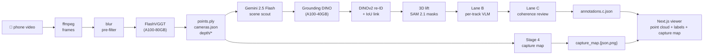

# spatiality_v2

**Phone video → 3D scene + open-vocabulary semantic labels + top-down capture map.**

From a 30–60 second handheld phone capture, the pipeline runs three lanes in parallel and joins them in the viewer:

- **Geometry** — ffmpeg + Laplacian-variance blur pre-filter → **FlashVGGT** single-forward dense pose + depth + per-pixel `world_points` on A100-80GB.
- **Semantics** — **Gemini** scene scout → **Grounding DINO** detection per slice → **DINOv2** appearance re-ID → multi-view 3-D lift off VGGT's `world_points` (gated by **SAM 2.1** masks) → **Gemini Lane B + Lane C** two-pass labelling (per-track, then whole-scene coherence review).
- **Capture map** — Stage 4 floor-fit + above-floor density rasterisation. CPU only, no model.

Outputs: a **12–50 M-point coloured cloud** with per-frame OpenCV cameras, **~30 open-vocab 3D-labelled objects**, and a **5 cm top-down density map** — end-to-end in ~14–19 min on Modal A100s. No calibration capture, no fixed taxonomy, no manual labelling.

&nbsp;

## Evidence

### ▶ [Live demo · spatiality-v2.vercel.app](https://spatiality-v2.vercel.app)

_(might have a long loading duration as 50,000,000 points need to be loaded on web 🥲)_

<table>
  <tr>
    <td align="center">

https://github.com/user-attachments/assets/e0bd3b8d-ab3f-4f66-b8c8-e78208d06a0f

<sub>Showcasing 3D reconstruction</sub>
    </td>
    <td align="center">

https://github.com/user-attachments/assets/6e457084-cf2c-425e-bc4e-a94b9e32e3b3

<sub>Coherent semantics and geometry</sub>
    </td>
  </tr>
</table>

<table>
    <tr>
      <td align="center"><br><sub>Pipeline Timings</sub></td>
      <td align="center"><br><sub>Object List</sub></td>
    </tr>
    <tr>
      <td align="center"><br><sub>Evidence of Objects</sub></td>
      <td align="center"><br><sub>Input Video</sub></td>
    </tr>
</table>

Full runtime + cost numbers in [Runtime and cost](#runtime-and-cost) below.

&nbsp;

## Quickstart

Three paths, in order of setup cost.

### 1. Hosted demo (one click)

[spatiality-v2.vercel.app](https://spatiality-v2.vercel.app) opens on `/scenes/demo_piece` — no install, no GPU, no keys. The 1.3 GB scene streams from Cloudflare R2 via the `NEXT_PUBLIC_DEMO_CDN_URL` rewrite in [`web/next.config.mjs`](web/next.config.mjs); no demo data is committed to the repo.

### 2. Pre-baked scene, locally (no GPU, no keys, ~5 min)

Same scene as the hosted demo, served locally at full PLY quality. Needs Python 3.12, [pnpm](https://pnpm.io/installation), and ~3 GB disk.

```bash
git clone https://github.com/Harrishayy/spatiality_v2.git && cd spatiality_v2

# Pull the demo outputs (≈ 1.3 GB) into backend/data/outputs/demo_piece/
mkdir -p backend/data/outputs
curl -L -o /tmp/demo_piece_outputs.zip \
  https://github.com/Harrishayy/spatiality_v2/releases/download/demo-piece-v1/demo_piece_outputs.zip
unzip /tmp/demo_piece_outputs.zip -d backend/data/outputs/

# Install laptop-only backend deps (FastAPI + uvicorn; no torch, no Gemini SDK).
python3.12 -m venv .venv && source .venv/bin/activate
pip install -e ./backend

# Orchestrator on :8765, then viewer on :3000 in a second shell.
uvicorn backend.main:app --port 8765 --reload &
cd web && pnpm install && pnpm dev
```

Open `http://localhost:5173/scenes/demo_piece`. The optional `demo_piece_inputs.zip` (≈ 1.5 GB) on the same [release](https://github.com/Harrishayy/spatiality_v2/releases/tag/demo-piece-v1) ships the raw `source.mp4` + 900 extracted frames if you want to inspect the input.

### 3. Run on your own video

Two execution paths: **Modal** (recommended; what I built against) or **local CUDA** (experimental, untested).

**Common prereqs:** Python 3.12, pnpm, ffmpeg, ffprobe. Plus a [Pydantic AI Gateway](https://ai.pydantic.dev/) key (recommended, single key fans out to Gemini) **or** a direct `GEMINI_API_KEY`. A Hugging Face token if you want the VGGT-1B fallback (`facebook/VGGT-1B` is gated).

#### Path A: Modal (recommended)

The GPU stages run on Modal (A100-80GB for inference, A100-40GB for segmentation). The laptop only runs FastAPI + the web UI.

```bash
pip install modal && modal token new
# Modal workspace needs `huggingface` and `pydantic-gateway` Secrets populated
# (or rename in backend/modal/{inference,segmentation}.py).

modal deploy backend/modal/inference.py
modal deploy backend/modal/segmentation.py

# Orchestrator (:8765) + viewer (:3000) in two shells.
uvicorn backend.main:app --host 0.0.0.0 --port 8765 --reload
cd web && pnpm install && pnpm dev
```

Open `http://localhost:5173` and upload a 10–60 s phone video of a room.

Headless variants:

```bash
python scripts/run_pipeline_cli.py <scene_id>            # video at backend/data/inputs/<scene_id>/source.mp4
SCENE_ID=my_room bash scripts/run_scene.sh               # one-command: pipeline → viewer URL
SCENE_ID=my_room SAMPLE_URL=https://... bash scripts/run_scene.sh    # fetch remote clip
modal run backend/modal/inference.py::main    --input-id <scene_id>  # direct re-run, skip ffmpeg
modal run backend/modal/segmentation.py::main --input-id <scene_id> [--lanes b,c]
```

#### Path B: Local CUDA GPU ⚠️ experimental, untested

For an A100-class GPU (≥ 24 GB VRAM) and no Modal account. **Authored on macOS, never smoke-tested end-to-end** — dependencies are inferred from the Modal image builds, which remain the source of truth.

```bash
bash scripts/install_local_gpu.sh                 # requirements-local-gpu.txt + FlashVGGT (with patches/)
export PYDANTIC_AI_GATEWAY_API_KEY=...            # or GEMINI_API_KEY
export HF_TOKEN=...                               # only for VGGT-1B fallback
python scripts/run_local_gpu.py <scene_id>        # video at backend/data/inputs/<scene_id>/source.mp4
```

Then start the same orchestrator + viewer as Path A. Known unknown: FlashVGGT was built against torch 2.4 but the env pins torch 2.5.1; if that errors, fall back to two separate venvs. See [`backend/requirements-local-gpu.txt`](backend/requirements-local-gpu.txt) and [`scripts/install_local_gpu.sh`](scripts/install_local_gpu.sh).

### What you get

At the end of a pipeline run in `backend/data/outputs/<scene_id>/`:

```
points.ply                # 12–50 M coloured points (xyz+rgb+confidence)
cameras.json              # per-frame K, R, t (OpenCV convention)
annotations.c.json        # open-vocab 3D-labelled objects, coherence-reviewed
capture_map.json          # 5 cm top-down density grid (Stage 4)
capture_map.png           # top-down preview of the captured footprint
```

&nbsp;

## Project structure

```
backend/
  main.py                       FastAPI orchestrator (laptop, port 8765)
  modal/
    inference.py                Modal app: spatiality-inference (FlashVGGT)
    segmentation.py             Modal app: spatiality-segmentation (GDINO + lift + Lane B/C + Stage 4)
  src/spatiality/
    inference/                  FlashVGGT runner, frame select, PLY writer
    segmentation/               GDINO, re-ID, lift, lane_b, lane_c, postprocess
    nav/capture_map.py          Stage 4: top-down density map of captured scene
  requirements-local-gpu.txt    Pip set for the local-GPU path
scripts/
  run_scene.sh                  One-command driver: video → pipeline → viewer (Modal)
  run_pipeline_cli.py           Headless end-to-end driver (Modal path)
  run_local_gpu.py              Local-CUDA end-to-end driver (no Modal, experimental)
  install_local_gpu.sh          Installer for the local-GPU dependency set
web/                            Next.js viewer (rewrites demo_piece URLs to R2)
docs/                           Reviewer notes (PIPELINE.md, DESIGN_DECISIONS.md)
patches/                        FlashVGGT upstream-pyproject carry
```

&nbsp;

## Design note

The compute side is two Modal apps, not one per model. `spatiality-inference` runs FlashVGGT alone on A100-80GB; everything else (scout, detector, re-ID, masks, both labelling passes, capture-map post-process) runs **inside one shared `spatiality-segmentation` container instance** on A100-40GB — same warm GPU, persistent SAM 2.1 encoder cache, no per-model cold-starts. The orchestrator (FastAPI on `:8765`) and the viewer (Next.js + three.js) run on the laptop.

### Architecture


```mermaid
flowchart LR
    capture["📱 phone video"] --> extract["ffmpeg<br/>frames"]
    extract --> blur["blur<br/>pre-filter"]
    blur --> flashvggt["FlashVGGT<br/>(A100-80GB)"]
    flashvggt --> ply["points.ply<br/>cameras.json<br/>depth/*"]
    ply --> scout["Gemini 2.5 Flash<br/>scene scout"]
    scout --> gdino["Grounding DINO<br/>(A100-40GB)"]
    gdino --> link["DINOv2 re-ID<br/>+ IoU link"]
    link --> lift["3D lift<br/>SAM 2.1 masks"]
    lift --> laneB["Lane B<br/>per-track VLM"]
    laneB --> laneC["Lane C<br/>coherence review"]
    laneC --> annotations["annotations.c.json"]
    ply --> capmap["Stage 4<br/>capture map"]
    capmap --> nav["capture_map.{json,png}"]
    annotations --> viewer["Next.js viewer<br/>point cloud + labels + capture map"]
    nav --> viewer
```

Two parallel branches fork off the dense cloud and rejoin in the viewer:

- **Geometry (top of diagram).** ffmpeg extracts frames → a Laplacian-variance blur pre-filter drops the bottom 20 % → FlashVGGT runs a single forward pass over the whole sequence on an A100-80GB → out comes a coloured point cloud (`points.ply`), per-frame camera intrinsics and extrinsics (`cameras.json`), per-frame depth, and, critically, VGGT's `point_head` outputs (`world_points` + `world_points_conf`). Every downstream stage is wired to consume those tensors.
- **Semantics (middle).** Gemini 2.5 Flash plays "scene scout" over temporal slices and proposes the noun phrases it actually sees → Grounding DINO detects those phrases per slice → a SORT-style linker with DINOv2-small appearance embeddings forms 2-D tracklets → **the 3-D lift uses VGGT's `world_points` tensor as the source of truth for each pixel's xyz, sampling only the pixels SAM 2.1 marks as belonging to the object, then keeping a point only if it reprojects into ≥ 50 % of other frames' masks**. No manual `K⁻¹ · depth · pixel` unprojection, no separate triangulation step. → Lane B labels every track in isolation via Gemini → Lane C reviews the whole scene in one Gemini call and relabels, drops, or merges tracks for coherence.
- **Capture map (bottom).** Stage 4 takes the same `world_points` cloud directly, fits a floor plane to it, and rasterises above-floor density into a top-down PNG + JSON. CPU only, no extra model.

The Next.js viewer fetches all three outputs and renders them as one orbitable scene with a labelled inventory and the top-down minimap. Long-form stage-by-stage notes in [`docs/PIPELINE.md`](docs/PIPELINE.md).

### Design choices and novel decisions

The pipeline composes off-the-shelf components, but a handful of choices in each stage materially change the output. The full rationale, every alternative considered, and the failure mode that ruled it out lives in [`docs/DESIGN_DECISIONS.md`](docs/DESIGN_DECISIONS.md) (~600 lines, 14 sections). What follows is one paragraph per stage.

**Geometry.** FlashVGGT in a single forward pass beats chunked solves (which pin each chunk's first frame at the origin and produce N disjoint rooms), DUSt3R and MASt3R (pair-based, weak at long handheld sequences), and COLMAP-style SfM (slow, brittle on textureless walls and motion blur). VGGT-1B stays in the image as a transparent fallback for short clips and any case where the FlashVGGT build fails. The new piece worth flagging is a Laplacian-variance blur pre-filter that drops the worst 20 percent of frames before the pose head ever sees them. A single blurry frame can push the chunked-attention feature bank off by more than 30 degrees in rotation, which makes this the single highest-impact fix for handheld phone captures. See [`frame_select.py`](backend/src/spatiality/inference/frame_select.py) and [`DESIGN_DECISIONS.md §1–§2`](docs/DESIGN_DECISIONS.md).

**Semantics.** Two related new choices work together here. The first is a scoped Gemini scene scout: instead of running Grounding DINO against a fixed taxonomy or every possible noun, Gemini proposes noun phrases per temporal slice and GDINO fires those phrases only within their slice windows, with cross-phrase NMS at IoU 0.7 stopping two synonyms from forking the same object into parallel tracklets. That gives open-vocabulary recall without the false-positive deluge that querying for everything would produce. The second is the 3-D lift itself, which reads each pixel's xyz directly from VGGT's `world_points` tensor (so there is no manual unprojection step) and keeps a point only if it reprojects into at least 50 percent of other frames' SAM 2.1 masks. That filter is what kills the floor-bleed failure mode where unmasked floor pixels get pinned to whichever object is closest. SAM 3.1 video propagation was tried and dropped because it cost about ten minutes per scene for masks the lift did not end up consuming; SAM 2.1-hiera-tiny stays as a cheap single-frame mask inside the lift. See [`scene_scout.py`](backend/src/spatiality/segmentation/scene_scout.py), [`lift.py:380`](backend/src/spatiality/segmentation/lift.py), and [`DESIGN_DECISIONS.md §3–§6`](docs/DESIGN_DECISIONS.md).

**Labelling.** Two passes of Gemini 2.5 Flash via PydanticAI. Lane B labels each track in isolation; Lane C reviews the whole scene at once and is allowed to relabel, drop, or merge tracks for coherence. Gemini Flash was chosen over Claude and OpenAI VLMs on multi-image latency and per-scene cost. The VLM is swappable via the `SPATIALITY_VLM_MODEL` environment variable, and `vlm.py` is the only file that knows the model id. The operational change worth flagging is that Lane B checkpoints per track rather than per stage: an earlier per-loop flush lost 24 labels to a single cancellation, so flushing immediately after every Gemini response means a cancellation now costs one missing track rather than the whole scene. See [`lane_b.py`](backend/src/spatiality/segmentation/lane_b.py) and [`DESIGN_DECISIONS.md §7–§11`](docs/DESIGN_DECISIONS.md).

**Stage 4 capture map.** This stage intentionally uses no model. Floor extraction is robust statistics (the mode of the lower-percentile point heights after a histogram pass), and the top-down rasterisation is numpy and Pillow. The reframing is the interesting part. An earlier version of this stage was framed as a humanoid traversability and free-space map, but handheld captures rarely observe enough floor to support that inference honestly. Pivoting to "show what we actually saw" is the version every run can produce meaningfully, and it ships as both a JSON density grid and a PNG preview. See [`capture_map.py`](backend/src/spatiality/nav/capture_map.py) and [`DESIGN_DECISIONS.md §12`](docs/DESIGN_DECISIONS.md).

**Philosophy.** Simple beats clever when simple works. Single forward beats chunking. Per-unit checkpointing beats per-stage flushes. VLMs are for labelling and judgement, never for geometry. See [`DESIGN_DECISIONS.md §0`](docs/DESIGN_DECISIONS.md).

### Tradeoffs

<table>
    <tr>
      <td align="center"><br><sub>Mistaken Headphone Case for Portable Speaker</sub></td>
      <td align="center"><br><sub>Mistaken Reflection for Recessed Light</sub></td>
    </tr>
    <tr>
      <td align="center"><br><sub>Mistaken Hard Drive Case for Portable Speaker</sub></td>
    </tr>
</table>

The three most user-visible costs (full list in [`docs/DESIGN_DECISIONS.md`](docs/DESIGN_DECISIONS.md)):

- **The VLM mislabels confidently and often.** Gemini 2.5 Flash is given a 3×3 anchor grid plus orbital novel-view renders per track and asked to name what it sees. Real failures from `demo_piece`: a hard drive labelled "portable speaker", a headphone box also labelled "portable speaker", a glossy door reflection labelled "recessed light". Lane C catches cross-scene inconsistencies but not visually-plausible single-track wrongness. The single largest source of user-visible errors.
- **Multi-view ≥ 50 % rule is a sledgehammer.** It cuts the floor-bleed failure mode, but it also drops legitimate object pixels glimpsed in only a handful of oblique frames. The 50 % is hand-tuned; the honest answer is a learned curve, not a step.
- **Hardware floor.** FlashVGGT single-forward on 500 frames needs an A100-80GB. The base-VGGT fallback can run on smaller cards for short clips, but the long-sequence quality story doesn't survive the fallback.

### Future work

In ship order, if this were full-time:

- **Mask-conditioned VLM prompt + OBB dimensions.** Alpha-cut the background with the SAM mask and pass `"≈ 14 × 9 × 2 cm at 0.75 m height"` into the prompt — makes "portable speaker" geometrically impossible for a hard drive. Kills the largest user-visible failure mode.
- **Calibration set + eval harness.** mAP / 3D-OBB IoU / pose RMS on hand-annotated scenes. Unlocks everything below; the only honest fix for "confident wrong label."
- **Plane-constrained bundle adjust on top of VGGT.** Manhattan-world prior from detected floor/wall/ceiling planes refines VGGT extrinsics — expect 5–15 cm tighter centroids and a cleaner gravity vector for Stage 4.
- **Open-source VLM swap.** [SmolVLM](https://huggingface.co/HuggingFaceTB/SmolVLM-Instruct) / [Qwen2-VL](https://github.com/QwenLM/Qwen2-VL) / [LLaVA-OneVision](https://github.com/LLaVA-VL/LLaVA-NeXT) — drops cost to ~$0 and kills the closed-API dependency.

&nbsp;

## Runtime and cost

| | Value |
|---|---|
| End-to-end wall clock | ~14–19 min (500 frames, full Lanes B + C + Stage 4) |
| FlashVGGT forward pass | ~5–6 min on A100-80GB |
| Modal cost per scene | ~$0.70–$1.20 |
| Gemini cost per scene | ~$0.05–$0.15 (scout + ~30 Lane B calls + 1 Lane C) |
| Disk per scene | ~3 GB on Modal |

The orchestrator's [`_PULL_SKIP_PREFIXES`](backend/main.py) skips pipeline-internal artefacts (depth maps, full-res frames, checkpoints) when mirroring the Modal volume locally, so the laptop only stores the user-facing payload.

&nbsp;

## References

The pipeline is built almost entirely on open-source components. Each entry below explains *what we use from it*, not just what it is.

**Geometry**

1. **FlashVGGT** (Dec 2025). [github.com/wzpscott/FlashVGGT](https://github.com/wzpscott/FlashVGGT). Single-forward dense pose + depth + per-pixel `world_points` over a 500-frame sequence on A100-80GB. We carry a small `pyproject.toml` patch in [`patches/`](patches/) because upstream's packaging is broken.
2. **VGGT-1B** — Wang et al. *VGGT: Visual Geometry Grounded Transformer*. CVPR 2025. [github.com/facebookresearch/vggt](https://github.com/facebookresearch/vggt) · [HF model](https://huggingface.co/facebook/VGGT-1B). Transparent fallback for short clips and any case where the FlashVGGT image fails to build. Same API surface (`world_points` + `world_points_conf`), so the lift code is unchanged.

**Semantics**

3. **Grounding DINO** — Liu et al. *Grounding DINO: Marrying DINO with Grounded Pre-Training for Open-Set Object Detection*. ECCV 2024. [arXiv:2303.05499](https://arxiv.org/abs/2303.05499) · [`IDEA-Research/grounding-dino-base`](https://huggingface.co/IDEA-Research/grounding-dino-base). Open-vocab 2-D detection per temporal slice, fired only on the scout-proposed phrases within each slice window.
4. **DINOv2** — Oquab et al. *DINOv2: Learning Robust Visual Features without Supervision*. arXiv:2304.07193 (2023). [github.com/facebookresearch/dinov2](https://github.com/facebookresearch/dinov2). The small variant produces appearance embeddings inside the SORT-style tracklet linker — better at instance-level discrimination than CLIP for indoor furniture.
5. **SAM 2.1** — Ravi et al. *SAM 2: Segment Anything in Images and Videos*. arXiv:2408.00714 (2024). [github.com/facebookresearch/sam2](https://github.com/facebookresearch/sam2). `sam2.1-hiera-tiny` is used as a single-frame mask inside the 3-D lift to gate which pixels of `world_points` belong to the object. SAM 3.1 video propagation was tried and dropped (~10 min/scene for masks the lift didn't consume).

**Vision-language model + scaffolding**

6. **Gemini 2.5 Flash** via **PydanticAI** — [ai.pydantic.dev](https://ai.pydantic.dev/). Three jobs: (a) scene scout proposes per-slice noun phrases for GDINO; (b) Lane B labels each track in isolation; (c) Lane C reviews the whole scene and can relabel/drop/merge. PydanticAI gives us structured outputs so each call returns a typed pydantic model — no JSON-parsing failure mode. The VLM is swappable via `SPATIALITY_VLM_MODEL`.

**Runtime + viewer**

7. **Modal** — [modal.com](https://modal.com/). GPU runtime: one A100-80GB app for FlashVGGT, one A100-40GB app holding GDINO + SAM 2.1 + DINOv2 + Gemini calls in a single warm container.
8. **FastAPI** + **uvicorn** — laptop-side orchestrator on `:8765`. Hands jobs to Modal, mirrors outputs back, serves `/api/jobs/<id>` and `/artifacts/scenes/<id>/*` to the viewer.
9. **Next.js + three.js** — [nextjs.org](https://nextjs.org/) · [threejs.org](https://threejs.org/). Streaming PLY parser renders 50 M-point clouds in the browser at interactive frame rates. Hosted on [Vercel](https://vercel.com/) behind Cloudflare R2 for the demo scene.

&nbsp;

## License

[MIT](LICENSE).
